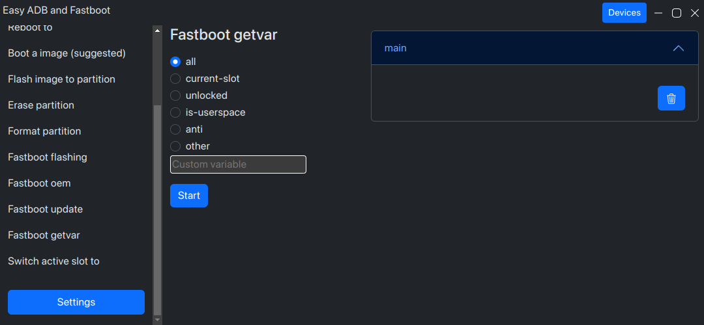
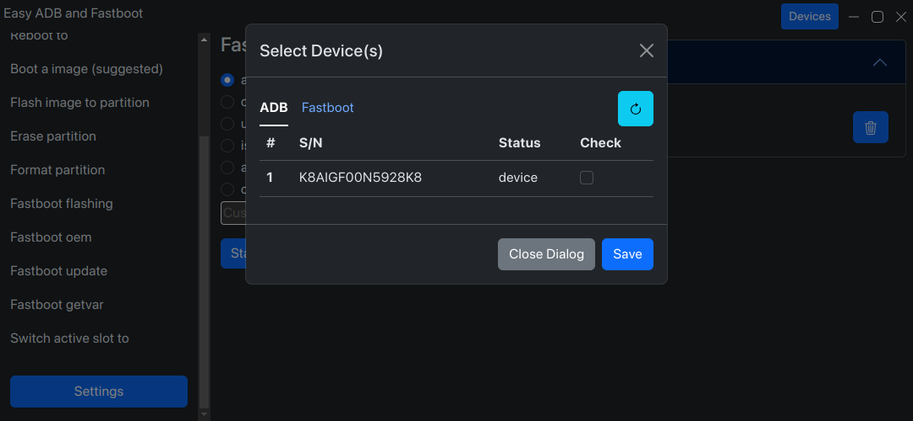
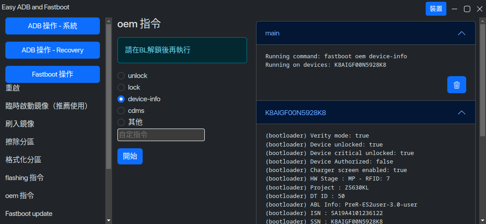

中文版請[點我](./README-zh.md)

# Easy ADB and fastboot (EAF)

#### Note: Settings > Online Updates is still in progress, in order to update the app, see the instructions below

## What is EAF

EAF is a graphical manager of ADB (Android Debug Bridge) and fastboot.

## Features of EAF

- Commonly used ADB and fastboot commands
- Power management (reboot to system, recovery, bootloader ,etc.)
- Flash/erase partition
- Run fastboot flashing/oem commands
- Get fastboot stored variables
- Switch between A/B slots
- Flash zips using PC
- You can now opreate multiple devices at the same time, imagine that rooting 10 phones with one click!

## Screenshot(s)





## Supported platforms

Linux and Windows are officially supported, ~~for macOS users, you can build it by yourself.~~

## Install & Update

### Install

Download release files from [Releases](https://github.com/ryantsui1109/Easy_ADB_fastboot/releases) page, or from our [Website](https://ryantsui1109.github.io/eaf_web/en)


#### Windows
Please double click the exec file to install. 
#### Linux 
Extract the tar.xz, and excute `easy_adb_fastboot` which should be inside the folder.

### Update

#### Windows

Updates will be checked every few days, you can set it in the settings page, or you can check it manually

#### Linux

Currently not supported, download manually from the links above.

### Changelog

See what I've done recently [here](./更新說明.md).

## Building from source (For both platforms)

1. Clone this repository
1. Install Node.js and npm
1. Install dependencies

   ```console
   $ npm install
   ```

1. Download platform-tools

   ```console

   $ node scripts/eaf_builder.js -d #Windows and Linux only, for mac users, please download manually from Google's site
   ```

1. Configure EAF
   ```console
   $ node scripts/eaf_builder.js -i=<index> -c=<channel> #index should be a number, and channel should be a string
   ```
1. Build EAF
   ```console
   $ npm run build #build locally
   ```
   or
   ```console
   $ npm run publish #build and upload release server (any releasing way that electron-build supports)
   ```
